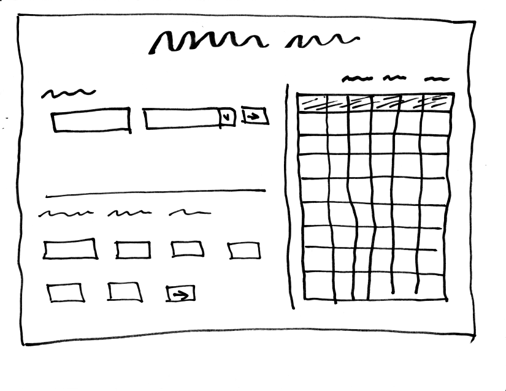
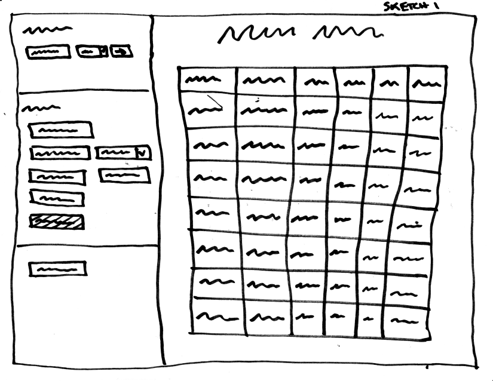
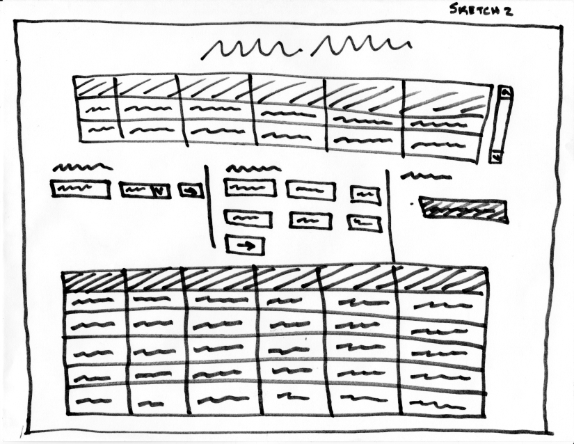
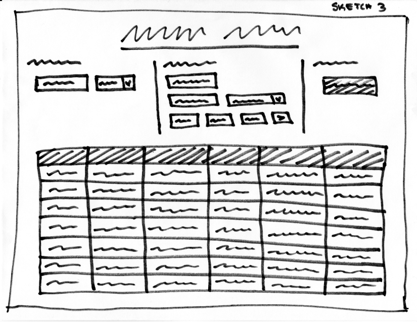
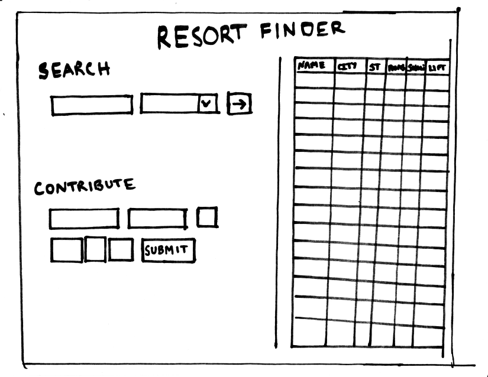
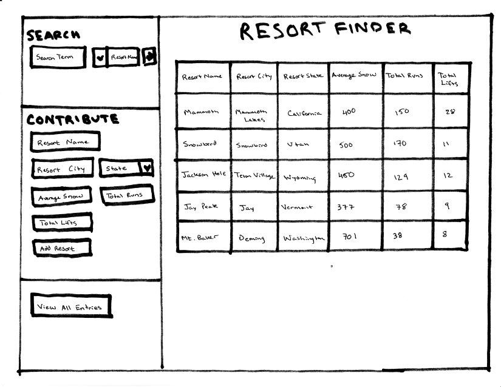

# Project 2, Milestone 1 - Design & Plan

Your Name: Constantin Yuri Miranda

## 1. Persona

I've selected **Abby** as my persona.

I've selected my persona because though she likes math, she does not have much background in computer programming or IT, which will not be necessary for my catalog website outlining popular ski resort destinations in the United States. Furthermore, she does uses technology to accomplish her tasks and stays very focused, the perfect persona for a site that I will design to be streamlined, simple, and focused on the task at hand. Finally, Abby leans towards process-oriented learning, which I will cater towards by providing very clear instructions on how to use the site.

## 2.Describe your Catalog

[What will your collection be about? What types of attributes (database columns) will you keep track of for the *things* in your collection? 1-2 sentences.]

My collection will be about popular ski resort destinations in the United States. Attributes for my database will include:
- Name of resort
- City the resort is closest to
- State the resort is located in
- Minimum Total number of runs (will help **Abby** to search for resorts with *at least* x number of runs)
- Minimum Average seasonal snowfall (will help **Abby** to search for resorts with *at least* x inches of average snowfall)
- Minimum Number of chairlifts (will help **Abby** to search for resorts with *at least* x number of chairlifts)

## 3. Sketch & Wireframe

**Sketch**

*Based on feedback from my milestone, I focused on more idea generation in my sketches. The original is included above, and the additional sketches are below.*




**Wireframe**

*Based on feedback from my milestone, I added labels to all of my buttons and replaced any filler text with actual text. The new wireframe is shown below, while the original remains above.*


This design is suitable for my persona because it is very simple and straightforward. There are not many buttons and every single field will be labeled so as not to confuse **Abby**.

## 4. Database Schema Design

[Describe the structure of your database. You may use words or a picture. A bulleted list is probably the simplest way to do this.]

Table: resorts
- field 1: resort_name: TEXT, Name of the resort, Not Null
- field 2: resort_city: TEXT, City the resort is located in,
- field 3: resort_state: TEXT, State the resort is located in,
- field 4: min_runs: NUMBER, Number of total runs the resort has
- field 5: min_snow: NUMBER, Minimum amount of average snowfall the resort receives
- field 6: min_lifts: NUMBER, Number of lifts the resort has

*Note to the Above: I changed my database to reflect the feedback from the first milestone. Changes included:*
- *Removal of "Not Null" from all fields except for the resort name field so that users like Abby do not have to know the information to contribute to the database*
- *Removing the primary key attribute from the resort_name field since there might be multiple resorts with the same name across the country*
- *Simplifying column names.*

## 5. Database Query Plan

[Plan your database queries. You may use natural language, pseudocode, or SQL.]

1. All records
```sql
SELECT * FROM resorts;
```

2. Search records by user selected field
```sql
SELECT *  FROM resorts WHERE column="userinput";
```
**OR**
```sql
SELECT *  FROM resorts WHERE column>"userinput";
```
*Note: The column will be the user specified attribute he/she is searching and the userinput will be the value they are searching for. For the resort_name, resort_city, and resort_state, this will be searched using an equals sign. For the min_total_runs, min_avg_snowfall, and min_nbr_lifts, this will be searched using a less than sign since they are searching for minimum values.*

3. Insert record
```sql
INSERT INTO resorts (
 resort_name,
 resort_city,
 resort_state,
 min_runs,
 min_snow,
 min_lifts)
VALUES
 (
 :input_resort_name,
 :input_resort_city,
 :input_resort_state,
 :input_min_snow,
 :input_min_runs,
 :input_min_lifts
 );
```


## 6. *Filter Input, Escape Output* Plan

[Describe your plan for filtering the input from your HTML forms. Describe your plan for escaping any values that you use in HTML or SQL. You may use natural language and/or pseudocode.]

My plan for filtering the input from my HTML form is to use types/regular expressions:
- Resort Name: Only allow for text to be included and erase any leading or trailing spaces for **Abby**
- Resort City: Only allow for cities to be typed with text.

*Note to the Above: Edited to only be "cities" rather than "United States cities" since this would prove to be extremely difficult without an external resource*

- Resort State: Implement a drop-down menu that includes the 50 states and the District of Columbia
- Minimum Average Snowfall: Only allow for text to be input

*Note to the Above: Edited to include this since I forgot to include this*
- Minimum Total Runs: Only allow for a number to be input.
- Minimum Number Lifts: Only allow for a number to be input.

For escaping output, I will use htmlspecialchars() to ensure that users with bad intentions will not be able to  inject code.

## 7. Additional Code Planning

[If you need more code planning that didn't fit into the above sections, put it here.]

**Note: I did not plan how to handle duplicate entries. Though a resort with a duplicate name should be able to be added, a resort with the same name but a different State SHOULD be able to be added. Thus, I took care of this by checking the table for previous entries with the same name and state and then determined whether the entry should be added based on this information.**
